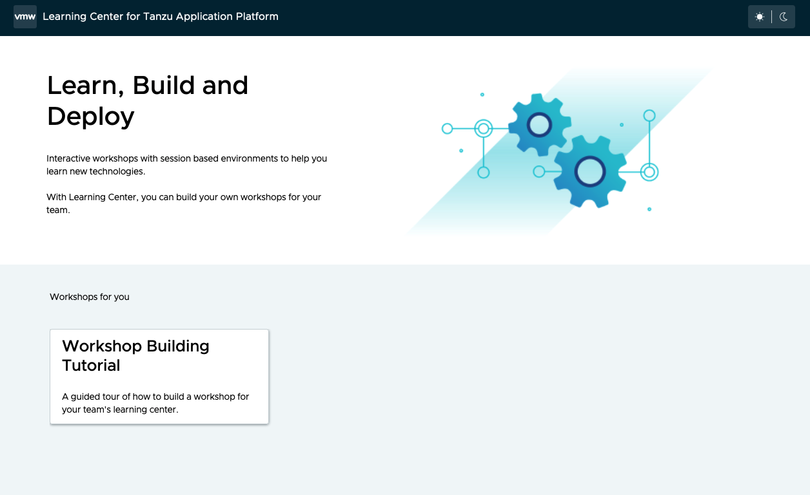
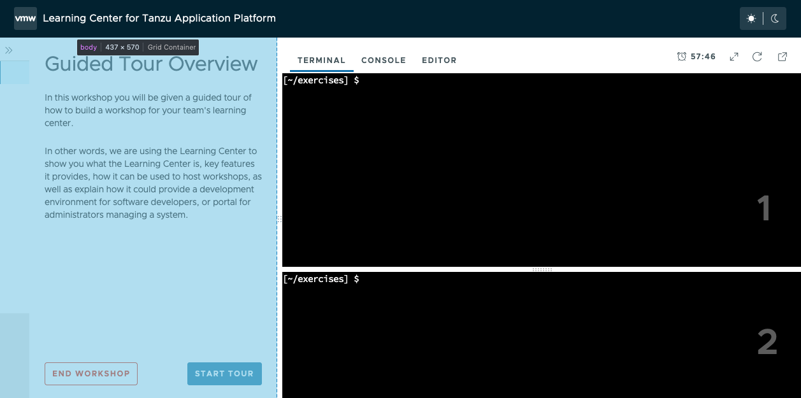

# Modifying the default theme for Learning Center
## Overview
This repository provides an example for leveraging kapp-controller's conventions to add in additional configuration to a PackageInstall object.  The example here allows you to make changes to the default Learning Center configuration to apply small theming changes.

## Quickstart
```
kubectl apply \
-n <your-tap-install-namespace>
-f theme-overlay.yaml

kubectl annotate packageinstall \
  -n <your-tap-install-namespace> \
  <your-tap-packageinstall-name> \
  ext.packaging.carvel.dev/ytt-paths-from-secret-name.0=learningcenter-package-overlay
```

### Example
If you used the TAP install instructions to install, then the commands you use would look like this:
```
kubectl apply \
-n tap-install
-f theme-overlay.yaml

kubectl annotate packageinstall \
  -n tap-install \
  tap \
  ext.packaging.carvel.dev/ytt-paths-from-secret-name.0=learningcenter-package-overlay
```

## Modifications
This repo allows you to modify the default  `SystemProfile` object that is installed with Learning Center to inject Javascript and CSS into various UIs.  You can read more about this capability in the [documentation](https://docs.vmware.com/en/VMware-Tanzu-Application-Platform/1.2/tap/GUID-learning-center-runtime-environment-system-profile.html#overriding-styling-of-the-workshop-12).

You can add styles and custom Javascript to three main areas of Learning Center.
* The "Portal" used to display the catalog of workshops hosted by a training portal
* The "Dashboard" used to surround workshop instructions
* The "Workshop" content and navigation 

### Portal
The default portal for Learning Center looks something like this: 



Using the `portal` element in the `theme-overlay.yaml`, you can add in arbitrary Javascript and CSS to be injected into that view.  The default theme overlay in this repo simply outputs a log message to the browser Javascript console, and hides the header bar on the portal page.

### Dashboard and Workshop
Once you launch a workshop session, you see a UI similar to the following:



In the image, the part the is highlighted in light blue is the part that styling for the "Workshop" would apply to.  The un-highlighted parts would be the parts that the styling for the "Dashboard" would apply to.

In the `theme-overlay.yaml` in this repo, modify the `SystemProfile` to output log messages for each of the "Workshop" and "Dashboard" sections as they load, and we hide the header in the "Dashboard", and change the font for the "title" elements of the workshop content in the "Workshot" section.

## What is going on!?
In the quickstart, there are few things going on that might seem confusing.  First, we are applying the contents of the `theme-overlay.yaml` file to the cluster and namespace where TAP's PackageInstalls are.  The contents of this file contain two secrets.  

The secret named `learningcenter-package-overlay` is used as an overlay definition to modify the deployment manifests applied via the TAP install package.

Because TAP is a package of package or "meta package," the details for the Learning Center install are actually not inside the TAP package itself.  The TAP package simply creates other `PackageInstall` objects that install the various parts of TAP, such as Learning Center.  So the first secret we apply is an overlay to apply an annotation recognized by kapp-controller that allows us to apply an overlay to the Learning Center package.

The secret with the name `theme-overlay` is where the real work is being done.  This overlay contains the modifications we want to make to the default `SystemProfile` object installed with the Learning Center package.  You can see we're merging in a change to add our theming additions in that secret.

But at this point, we need to somehow add the first overlay that kicks everything off.  That's what the second command in the Quickstart does.  It applies the kapp-controller recognized annotation to apply overlays to the top level TAP `PackageInstall` object, which then applies the secrets we first created as overlays to the TAP install.

Here's a diagram to try to convey how the different parts work together:
```mermaid
graph TD;
    start((start)) --> TAPPackageInstall[TAP PackageInstall]
    learningcenter-package-overlay[/learningcenter-package-overlay/] -.- TAPPackageInstall
    TAPPackageInstall-->LearningCenter-Packageinstall[Learning Center PackageInstall]
    theme-overlay[/theme-overlay/] -.- LearningCenter-Packageinstall
    LearningCenter-Packageinstall-->SystemProfile
    spec.theme.dashboard=...[/spec.theme.dashboard=.../] -.- SystemProfile
```